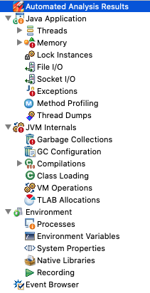

# JDK Flight Recorder 

The JDK Flight Recorder, open sourced in JDK 11 ([JEP 328](https://openjdk.java.net/jeps/328)), is a lightweight JVM tool for collecting diagnostic and profiling data about a Java application. 

## Using JFR

To use JFR you need to set the `-XX:StartFlightRecording` JVM argument, like in the example below:

```
java -XX:StartFlightRecording=disk=true,filename=recording.jfr,settings=profile,dumponexit=true <application>
```

### Configuring JFR 

When enabling JFR, `-XX:StartFlightRecording` can take several arguments like seen above that modify its behavior, below is the full list of arguments can take: 

* `delay=time`:
    Specifies the delay between the Java application launch time and the start of the recording. Append s to specify the time in seconds, m for minutes, h for hours, or d for days (for example, specifying 10m means 10 minutes). By default, there's no delay, and this parameter is set to 0. 
    <br/>
* `disk={true|false}`: 
    Specifies whether to write data to disk while recording. By default, this parameter is enabled. 
    <br/>
* `dumponexit={true|false}`:
    Specifies if the running recording is dumped when the JVM shuts down. If enabled and a filename is not entered, the recording is written to a file in the directory where the process was started. The file name is a system-generated name that contains the process ID, recording ID, and current timestamp, similar to `hotspot-pid-47496-id-1-2018_01_25_19_10_41.jfr`. By default, this parameter is disabled. 
    <br/>
* `duration=time`:
    Specifies the duration of the recording. Append s to specify the time in seconds, m for minutes, h for hours, or d for days (for example, specifying 5h means 5 hours). By default, the duration isn't limited, and this parameter is set to 0. 
    <br/>
* `filename=path`:
    Specifies the path and name of the file to which the recording is written when the recording is stopped, for example:<br/>

```
        recording.jfr
        /home/user/recordings/recording.jfr
        c:\recordings\recording.jfr
```
    
* `name=identifier`:
    Takes both the name and the identifier of a recording. 
    <br/>
* `maxage=time`:
    Specifies the maximum age of disk data to keep for the recording. This parameter is valid only when the disk parameter is set to true. Append s to specify the time in seconds, m for minutes, h for hours, or d for days (for example, specifying 30s means 30 seconds). By default, the maximum age isn't limited, and this parameter is set to 0s. 
    <br/>
* `maxsize=size`:
    Specifies the maximum size (in bytes) of disk data to keep for the recording. This parameter is valid only when the disk parameter is set to true. The value must not be less than the value for the maxchunksize parameter set with `-XX:FlightRecorderOptions`. Append m or M to specify the size in megabytes, or g or G to specify the size in gigabytes. By default, the maximum size of disk data isn't limited, and this parameter is set to 0. 
    <br/>
* `path-to-gc-roots={true|false}`:
    Specifies whether to collect the path to garbage collection (GC) roots at the end of a recording. By default, this parameter is disabled.<br/>
    The path to GC roots is useful for finding memory leaks, but collecting it is time-consuming. Enable this option only when you start a recording for an application that you suspect has a memory leak. If the settings parameter is set to profile, the stack trace from where the potential leaking object was allocated is included in the information collected.
    <br/>
* `settings=path`:
    Specifies the path and name of the event settings file (of type JFC). By default, the `default.jfc` file is used, which is located in `JAVA_HOME/lib/jfr`. This default settings file collects a predefined set of information with low overhead, so it has minimal impact on performance and can be used with recordings that run continuously.<br/>
    A second settings file is also provided, `profile.jfc`, which provides more data than the default configuration, but can have more overhead and impact performance. Use this configuration for short periods of time when more information is needed.

Source: [https://docs.oracle.com/en/java/javase/16/docs/specs/man/java.html](https://docs.oracle.com/en/java/javase/16/docs/specs/man/java.html)

## Retrieving JFR Recordings

There are a couple of options for retrieving JFR recordings

#### From Running Application

Recordings can be retrieved from a still running Java application using `jcmd` like this:

```
jcmd <pid> JFR.dump name=<name>
```

#### After Application Terminates

JFR can also automatically generate a recording file on application exit by setting 1`dumponexit=true` with `-XX:StartFlightRecording`

## Analyzing JFR Recordings

JFR recordings can be inspected with tools like [JDK Mission Control](https://www.oracle.com/java/technologies/jdk-mission-control.html).  

JDK Mission Control offers many options for inspecting results; memory usage, I/O, GC behavior, and more, whcih can be seen here: 



Happy Coding!