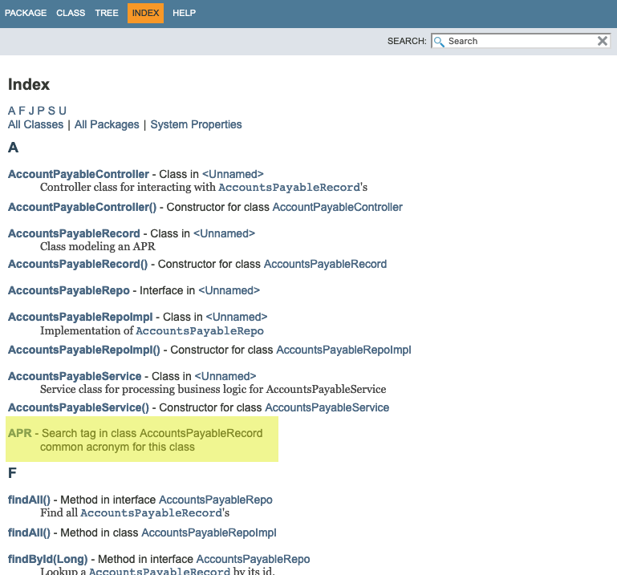

# JavaDoc Updates and Improvements
JavaDoc can be a great tool for both providing useful documentation on an application or API and to also explore the Java API. JavaDoc has seen several noteworthy improvements in recent releases of Java, let's take a look at a few of them.

## Search

Easily the most impactful addition to JavaDoc was the addition of a search tool. 


The search tool can help other developers explore documentation you have written for applications and APIs you maintain.

Search can also be a great tool for exploring the Java API on the official JavaDoc.

[Link to Java 16 JavaDoc](https://docs.oracle.com/en/java/javase/16/docs/api/index.html)

[Link to Java 11 JavaDoc](https://docs.oracle.com/en/java/javase/16/docs/api/index.html)

## New Tags

Several new tags have been added, giving more control when writing documentation for an application or API. 

### Index

Defining domain specific terms and acronyms is a common need. The inline `{@index term description}` allows for such terms and acronyms to be defined. 

```java
/**
 * Class modeling an
 *  {@index APR common acronym for this class}
 * 
 * @author bkorando
 *
 */
public class AccountsPayableRecord {

}
```



### Hidden

There can be some code that you want documented, but not published in generated JavaDoc. For this, there is `@hidden`. 

Here `findByOldbId()` shouldn't be published.

```java
public class AccountsPayableRepoImpl 
   implements AccountsPayableRepo {

    ...
    public void save(AccountsPayableRecord apr) 
    ...
    public List<AccountsPayableRecord> findAll() 
    ...
    public Optional<AccountsPayableRecord> findById(Long id) 
    ...
    
    /**
     * Look up a {@index APR} by its legacy id.
     * @hidden
     * @param id
     * @return
     */
    Optional<AccountsPayableRecord> 
      findByOldbId(Integer id){
        //TO-DO Implement
    }
}
```

And in the generated documentation `findByOldId` isn't included:


### System Properties

Often applications depend upon system provided values; passwords, urls, usernames, etc. `{@ systemProperty value}` can be used for documenting these properties.

```java
public class AccountsPayableRepoImpl 
   implements AccountsPayableRepo {

    /**
     * {@systemProperty username}
     */
    private String username;
    /**
     * {@systemProperty password}
     */
    private String password;
    /**
     * {@systemProperty jdbc.url}
     */
    private String jdbcUrl;
    
    ...
}
```
Generated JavaDoc:


### Module tags

With the release of JDK 9, tags were also added to JavaDoc for the definition of module concepts. 

* `@provides`: Defines service implementation this module provides.

* `@uses`: Defines services this module depends upon.

## HTML 5 Support

Also with JDK 9, JavaDoc is generated in HTML 5 by default. Improving accessibility and allowing the updated API and design features of HTML to be used in an application's documentation. 

## Extra Learning

Java 16 Specs: [https://docs.oracle.com/en/java/javase/16/docs/specs/javadoc/doc-comment-spec.html](https://docs.oracle.com/en/java/javase/16/docs/specs/javadoc/doc-comment-spec.html)

Java 16 JavaDoc documentation: [https://docs.oracle.com/en/java/javase/16/javadoc/javadoc.html](https://docs.oracle.com/en/java/javase/16/javadoc/javadoc.html#GUID-9E6AB571-AB0F-4279-9BBF-C0AF83345BF0)

Happy Coding!